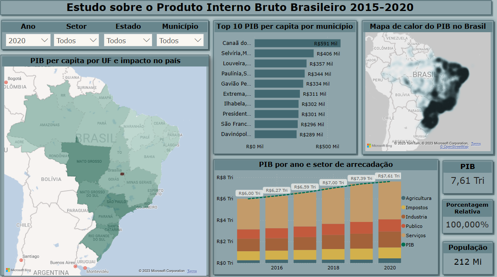

- [x] **Estudo do PIB brasileiro com Power BI**  

Utilizando consultas públicas disponíveis no banco de dados do IBGE, por meio da SIDRA e BME, para coletar informações sobre PIB estadual e municipal, valor adicionado bruto por setor da economia e população, construí um Dashboard para estudo do PIB em ambito municipal e estadual, além de saber quais setores têm maior influência em cada município. 
*Veja o Dashboard no Power BI Public:* **[Dashboard](https://app.powerbi.com/view?r=eyJrIjoiYzM1NThjOWYtNmM2Zi00M2ZkLTk3ZDktN2VmNWI5Yzg3YWUzIiwidCI6ImZlODc4N2JjLWM5MTQtNDY2NS04NTQ3LTI2OGUxNWNiMGQ5YSJ9)** 
<h1 align="center">
  
</h1>
